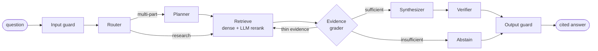

# AI Research Assistant: multi-agent RAG with evals and guardrails

Ask questions about ~200 arXiv papers on retrieval-augmented generation and get answers in
which **every sentence is fact-checked against the paper section it cites**. If the papers
don't say it, the assistant says so instead of guessing.

**[Live demo](https://aidocumentassistant.vercel.app/app)** · [API docs](https://rag-backend-meew.onrender.com/docs) ·
[Architecture](docs/agents.md) · [Retrieval experiments](docs/retrieval.md) ·
[Guardrails](docs/guardrails.md)


> The backend runs on a free tier that sleeps when idle. The first question can take up to
> a minute while it wakes up.

## Results

Each result is measured by an eval harness in this repo, not hand-picked. Golden set: 60
answerable questions plus 12 about papers that are *not* in the corpus. Red-team set: 26
attacks plus 11 legitimate questions.

| | Single-pass RAG baseline | This system |
|---|---|---|
| Answerable questions answered correctly | 93% | **100%** |
| Unanswerable questions correctly declined | 50% | **83%** |
| Faithfulness (answer claims supported by sources) | 98% | **100%** |
| Retrieval hit@1 / hit@5 | 0.73 / 0.93 | **0.85 / 1.00** |
| Prompt-injection and jailbreak attacks that succeeded | n/a | **0%** (92% refused outright) |
| Legitimate questions wrongly blocked by guardrails | n/a | **0%** |
| Latency p50 / cost per question | 1.4 s / $0.002 | 6.6 s / $0.007 |

The trade-off is deliberate. The system is about 5 seconds slower and 3× the cost per
question, and in exchange it gave no wrong answers on this set and declined far more
reliably. For a research tool, trust is the product.

## How it works



The pipeline is a **LangGraph** state machine. Each agent is a single LLM call with a
structured output, so every decision can be inspected and unit-tested, and the UI streams
each one live:

- **Router** rewrites follow-ups into standalone questions and sends greetings, off-topic
  and unsafe requests to a canned reply with no further LLM spend.
- **Planner** splits comparison questions into sub-questions that are searched in parallel.
- **Evidence grader** lists every specific detail the question depends on and checks that
  the sources actually cover each one. This fixed the baseline's main failure: answering
  questions about a missing paper from a similar one.
- **Corrective retrieval** gets one retry with a rewritten query, which keeps cost and
  latency bounded.
- **Verifier** checks each sentence against the source it cites and removes unsupported
  ones. Nothing is shown before verification.
- **Guardrails** add layers that cost no extra LLM calls: injection and PII screening,
  retrieved text fenced off as untrusted data, and a canary token that catches system-prompt
  leaks.

## Design decisions (and the evidence behind them)

| Decision | Why |
|---|---|
| **arXiv HTML, not PDF** | HTML keeps real section headings and tables. Section-aware chunking depends on them. ([details](docs/ingestion-and-chunking.md)) |
| **Parent/child chunks** | Small 350-token children are embedded for precise matching. The 1,200-token parent section is what the LLM reads. |
| **Dense + LLM reranker; hybrid search off by default** | Hybrid (RRF) helped 7 questions and hurt 9 on this set. The reranker lifted hit@1 from 0.73 to 0.85. ([experiments](docs/retrieval.md)) |
| **Postgres + pgvector, `halfvec(768)`** | One database for documents, vectors, full-text search and the ingestion queue. Half-precision vectors keep about 17k chunks inside a free tier. |
| **Ingestion queue with `FOR UPDATE SKIP LOCKED`** | Horizontally scalable workers with retries and stale-job recovery, without Redis or Celery. |
| **Answers verified, not streamed token by token** | Unverified text never reaches the user. The UI streams agent steps instead, so the wait is visible. |
| **Deterministic guardrails tuned for precision** | The corpus includes papers on RAG attacks. Questions *about* jailbreaks must still be answered, and 0% of legitimate questions were blocked. ([red-team results](docs/guardrails.md)) |
| **Cost controls** | Per-IP rate limits and a daily server-wide LLM budget keep a public demo safe to leave running. |

## Tech stack

**Backend:** Python 3.12, FastAPI, LangGraph, SQLAlchemy (async) + Alembic, Postgres 17 +
pgvector, OpenAI (`gpt-4.1-mini` / `nano`, `text-embedding-3-small`). The LLM layer is
provider-agnostic (Gemini is also implemented) and has rate limiting, retries, and cost
tracking.
**Frontend:** Next.js 16, React 19, TypeScript, Tailwind CSS 4. It's a thin client of the
backend's SSE API.
**Quality:** 68 pytest tests (the agent graph runs with scripted LLMs, so no network is
needed), ruff, mypy, GitHub Actions CI.
**Hosting (all free tier):** Render (API), Neon (Postgres), Vercel (frontend).

## Run it locally

You'll need Docker, [uv](https://docs.astral.sh/uv/), Node 20+, and an OpenAI API key.

```bash
# 1. Database
docker compose up -d db

# 2. Backend
cd backend
cp .env.example .env            # then set OPENAI_API_KEY
uv sync
uv run alembic upgrade head
uv run python -m app.ingestion.arxiv --max-papers 200   # fetch + queue papers
uv run python -m app.ingestion.worker                   # chunk + embed (~$0.06)
uv run uvicorn app.main:app --reload                    # http://localhost:8000/docs

# 3. Frontend (in another terminal)
cd frontend
echo "NEXT_PUBLIC_API_URL=http://localhost:8000" > .env.local
npm install && npm run dev                              # http://localhost:3000/app
```

Or run the API and database together with `docker compose up`.

### Evals

```bash
cd backend
uv run python -m evals.run --pipeline baseline --retrieval-only   # free, retrieval metrics
uv run python -m evals.run --pipeline agents                      # full answers + LLM judge (~$0.50)
uv run python -m evals.guardrails                                 # red-team suite (~$0.09)
uv run pytest
```

Every run writes a JSON and a Markdown report to
[`backend/evals/results/`](backend/evals/results/).

## Repository layout

```
backend/
  app/agents/      LangGraph pipeline, prompts, guardrails
  app/retrieval/   dense / keyword / hybrid search, LLM reranker
  app/ingestion/   arXiv loader, HTML parser, chunker, queue worker
  app/llm/         provider-agnostic chat + embeddings, cost tracking
  app/api/         /chat (SSE), /ask, /documents, /health, rate limits
  evals/           golden + red-team datasets, metrics, LLM judge, runners
frontend/          Next.js UI
docs/              design write-ups with results and limitations
```

## Limitations

- **Small eval sets.** With 72 golden questions, one unanswerable question moves
  abstention accuracy by 8 points. Questions were LLM-generated from the passages, which
  favors dense retrieval.
- **One judge model.** The same model family answers and judges, so self-preference bias is
  possible. Spot-checks agreed with the judge.
- **Fixed corpus.** User uploads were cut from scope in favor of evaluation depth.

Each design doc ends with a longer, honest list.

## License

MIT. See [LICENSE](LICENSE).
