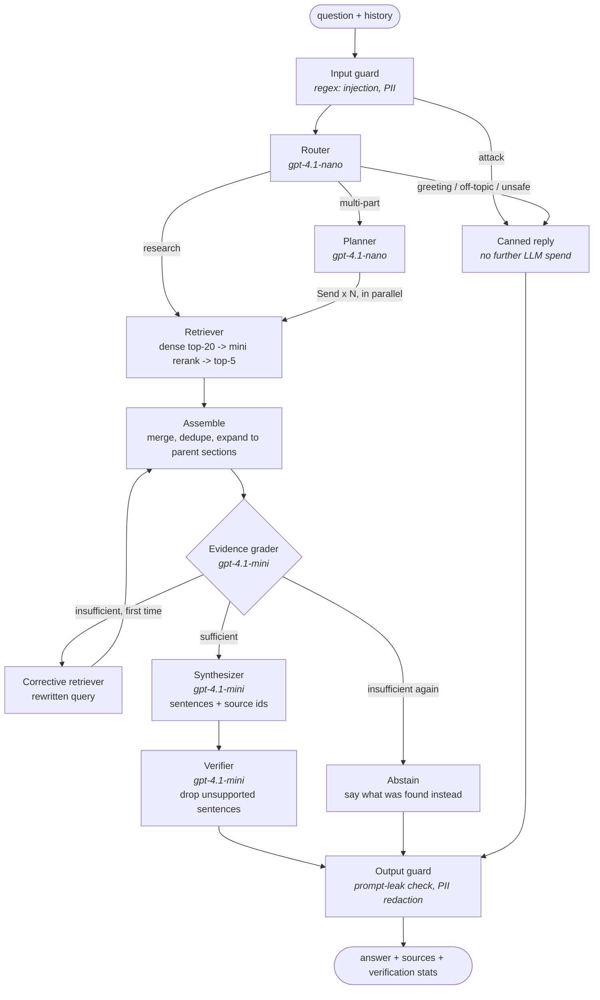

# Multi-agent answering

The answering pipeline is a [LangGraph](https://langchain-ai.github.io/langgraph/) state
machine ([`graph.py`](../backend/app/agents/graph.py)). Each agent is one LLM call with a
structured (JSON-schema) output, so every decision is inspectable, unit-testable, and
streamed to the UI as it happens.

## Why each agent exists

| Agent | Problem it solves |
|---|---|
| **Input / output guards** | Block prompt injection and prompt leaks, redact PII; no LLM calls. See [guardrails.md](guardrails.md). |
| **Router** | Resolves follow-ups ("what about its dataset?") into standalone questions; skips retrieval and LLM spend for greetings and off-topic requests. |
| **Planner** | Comparison and multi-part questions need evidence from several places; one search for "compare X and Y" tends to return only X. Sub-questions are searched in parallel with LangGraph's `Send`. |
| **Retriever** | Dense search + LLM reranker, chosen by evaluation ([retrieval.md](retrieval.md)). |
| **Evidence grader** | The baseline's main failure: asked about a paper *not* in the corpus, it answered from a similar paper. The grader lists every specific the question depends on (named methods, but also domains, datasets, populations) and which ones the sources don't cover. |
| **Corrective retrieval** | One retry with a rewritten query when evidence is thin, then stop: bounded cost and latency. |
| **Synthesizer** | Writes the answer as sentences, each tied to the source numbers that support it. |
| **Verifier** | Checks each sentence against its cited sources and removes unsupported ones before anything is shown. The answer is streamed only after verification. |

## Results

Golden set: 60 answerable questions and 12 about papers *not* in the corpus.
Same retrieval index, same judge (`gpt-4.1-mini`); reports in
[`backend/evals/results/`](../backend/evals/results/).

| Metric | Single-pass RAG | Multi-agent |
|---|---|---|
| Answered correctly (correctness ≥ 4/5), answerable | 0.93 | **1.00** |
| Correctly declined, unanswerable | 0.50 | **0.83** |
| Declined although answerable | 0.03 | **0.00** |
| Faithfulness (claims supported by shown sources) | 0.98 | **1.00** |
| Evidence present in the LLM's context | 0.93 | **1.00** |
| Citations valid | 1.00 | 1.00 |
| Latency p50 / p95 | 1.4 s / 2.0 s | 6.6 s / 8.1 s |
| LLM cost per question (incl. judge) | ~$0.0024 | ~$0.0074 |

On the 72 questions, the grader triggered 8 corrective searches and the verifier removed 1
unsupported sentence.

**Trade-off:** ~5 s and ~3× cost per question for no wrong answers on this set and a
large gain in knowing when to say "not found". For a research assistant whose value is
trust, that is the right side of the trade; the streaming UI shows each agent's progress
so the wait is visible, not silent.

## Limitations, honestly

- **The two remaining misses are underspecified questions.** u003 and u008 ask about
  "the study" / "the paper" without naming it, and another paper in the corpus does
  answer them literally. A better dataset would drop or rewrite them.
- **One judge model.** `gpt-4.1-mini` both answers and judges; self-preference bias is
  possible. Spot-checks agreed with its verdicts, but a second judge family would be better.
- **72 questions.** One unanswerable question is 8 points of abstention accuracy.
- **Prompt hygiene.** While tuning the grader, an example taken from a test question was
  caught and replaced with one that appears nowhere in the dataset, to avoid leakage.

## API

- `POST /chat`: Server-Sent Events. `step` events (`{agent, detail}`) as agents finish,
  then one `answer` event with the verified answer, numbered sources, and verification
  stats.
- `POST /ask`: the same pipeline, returning JSON (handy from the `/docs` page).

Both are protected by per-IP rate limits (6/minute, 40/day) and a daily server-wide cap
on estimated LLM spend.
